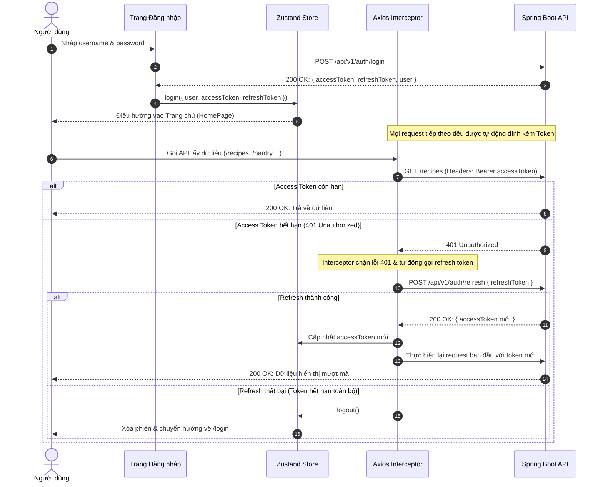

<div align="center">

# 🍳 SmartRecipe — Frontend Client

**Nền tảng Quản lý Công thức Nấu ăn & Đi chợ Thông minh Tích hợp Trợ lý AI**

[](https://react.dev/)
[](https://vitejs.dev/)
[](https://tailwindcss.com/)
[](https://tanstack.com/query)
[](https://zustand-demo.pmnd.rs/)
[](https://vitest.dev/)
[](https://vercel.com/)

<p align="center">
  Ứng dụng Single Page Application (SPA) hiện đại, trực quan và giàu tính tương tác dành cho những người yêu thích nấu nướng. Kết nối mượt mà với <b>Spring Boot REST API</b>, ứng dụng giúp tối ưu hóa tủ lạnh gia đình, tự động hóa danh sách đi chợ, gợi ý món ăn Zero-Waste từ Google Gemini AI, và cung cấp Cổng quản trị Admin chuyên sâu.
</p>

[Xem Bản Trực Tuyến (Live Demo)](https://smartrecipe-frontend.vercel.app) • [Tài liệu Backend API](https://github.com/NHTung-0801/smartrecipe-backend#readme) • [Báo cáo Lỗi](https://github.com/NHTung-0801/SmartRecipe-Project/issues)

</div>

---

## 📋 Mục lục

- [✨ Tính năng Nổi bật](#-tính-năng-nổi-bật)
- [🛠 Tech Stack & Công nghệ](#-tech-stack--công-nghệ)
- [🏛 Kiến trúc Ứng dụng](#-kiến-trúc-ứng-dụng)
- [🗺 Hệ thống Routing & Phân quyền](#-hệ-thống-routing--phân-quyền)
- [📂 Cấu trúc Thư mục Dự án](#-cấu-trúc-thư-mục-dự-án)
- [🗃 Quản lý State: Hai Tầng (Dual-Layer)](#-quản-lý-state-hai-tầng-dual-layer)
- [🔐 Luồng Xác thực (Auth Flow & Auto-Refresh)](#-luồng-xác-thực-auth-flow--auto-refresh)
- [🛒 Chu trình Đi chợ Thông minh (Smart Grocery Cycle)](#-chu-trình-đi-chợ-thông-minh-smart-grocery-cycle)
- [🎨 Hệ thống Design & Giao diện](#-hệ-thống-design--giao-diện)
- [🧪 Kiểm thử & Chất lượng (Unit Testing)](#-kiểm-thử--chất-lượng-unit-testing)
- [⚙️ Thiết lập & Khởi chạy Local](#-thiết-lập--khởi-chạy-local)
- [🐳 Docker & Triển khai Production](#-docker--triển-khai-production)
- [🔄 CI/CD Pipeline (GitHub Actions & Vercel)](#-cicd-pipeline-github-actions--vercel)

---

## ✨ Tính năng Nổi bật

### 1. 🤖 Trợ lý AI Bếp núc (Google Gemini Integration)
- **Zero-Waste Generator**: Phân tích các nguyên liệu sắp hết hạn trong tủ lạnh để đề xuất ngay món ăn phù hợp nhất, giảm thiểu tối đa lãng phí thực phẩm.
- **Feasible Recipe Finder**: Tìm kiếm và sáng tạo công thức nấu ăn linh hoạt dựa trên danh sách nguyên liệu người dùng nhập tùy ý.
- **Tự động trích xuất dinh dưỡng**: AI tự tính toán Calo, Protein, Fat, Carbs và thời gian chuẩn bị cho từng công thức.

### 2. 🧊 Tủ lạnh Thông minh (Smart Virtual Pantry)
- **Phân loại 9 kệ siêu thị**: Tự động sắp xếp nguyên liệu vào 9 kệ chuẩn (Rau củ, Thịt, Hải sản, Gia vị, Đồ khô, Sữa & Trứng, Trái cây, Dầu mỡ, Các loại hạt).
- **Hệ thống Cảnh báo Hạn dùng**: Đổi màu trực quan (Xanh: Còn hạn, Vàng: Sắp hết hạn trong 3 ngày, Đỏ: Đã quá hạn) cùng tính năng "Dọn tủ ngay".
- **Quy đổi Đơn vị Tự động**: Hỗ trợ chuyển đổi mượt mà giữa các đơn vị thông dụng (`ml`, `g`, `kg`, `thìa canh`, `chén`,...).

### 3. 🛒 Đi chợ Tự động (Smart Grocery Shopping)
- **Công thức trừ kho thông minh**: Khi chọn một hoặc nhiều món ăn cần nấu, hệ thống tự tính:
  $$\text{Số lượng cần mua} = \text{Tổng nguyên liệu công thức} - \text{Số lượng sẵn có trong tủ}$$
- **Chế độ Đi chợ Thực tế (Shopping Mode)**: Giao diện toàn màn hình tối ưu cho thiết bị di động khi ở siêu thị, hỗ trợ tick chọn từng món và thanh tiến độ hoàn thành theo từng kệ.
- **Tự động Cập nhật Kho (Auto Refill)**: Ngay khi nhấn "Hoàn thành chuyến đi chợ", toàn bộ nguyên liệu đã mua sẽ tự động được cộng dồn vào Tủ lạnh, kèm hiệu ứng Confetti rực rỡ.

### 4. 📖 Khám phá & Sáng tạo Công thức
- **Trình soạn thảo Công thức Đa bước**: Form nhập liệu thông minh với tính năng Autocomplete nguyên liệu, upload ảnh món ăn lên Cloudinary, quản lý từng bước thực hiện.
- **Chế độ Nấu ăn Rảnh tay (Cooking Mode)**: Hướng dẫn từng bước với chữ to, hình ảnh minh họa, đồng hồ đếm ngược hẹn giờ.
- **Xuất bản & Tương tác**: Hỗ trợ 4 trạng thái (`PUBLIC`, `PRIVATE`, `DRAFT`, `DELETED`), tính năng Sao chép (Clone) công thức, Thích (Like), Bình luận dạng cây phân cấp (Nested Comments), Xuất bản in và PDF.

### 5. 🛡️ Cổng Quản trị Admin Toàn diện (`/admin/*`)
- **Admin Dashboard**: Thống kê số lượng người dùng, công thức, nhật ký, tỷ lệ hoạt động và biểu đồ phân bổ.
- **Quản lý Nguyên liệu Chuẩn**: CRUD hơn 297+ nguyên liệu dinh dưỡng USDA, hỗ trợ gán kệ hàng và chỉnh sửa chỉ số calo/macro.
- **Kiểm duyệt & Quản trị Nội dung**: Quản lý trạng thái công thức của toàn bộ người dùng, quản lý tài khoản, danh mục Tags và Bảng quy đổi đơn vị đo lường.

---

## 🛠 Tech Stack & Công nghệ

| Phân tầng | Công nghệ / Thư viện | Phiên bản | Vai trò trong dự án |
|:---|:---|:---:|:---|
| **Core Framework** | React | `19.2` | Thư viện xây dựng giao diện người dùng dựa trên Component |
| **Build Tool** | Vite | `8.2` | Công cụ đóng gói siêu tốc với Hot Module Replacement (HMR) |
| **Routing** | React Router DOM | `7.18` | Định tuyến client-side, dynamic routes, nested layouts |
| **Server State** | TanStack Query (React Query) | `5.101` | Quản lý caching, background refetch, stale-while-revalidate |
| **Client State** | Zustand | `5.0` | Global Store nhẹ, quản lý phiên đăng nhập (Auth Session) |
| **HTTP Client** | Axios | `1.19` | Gọi REST API với Interceptors xử lý tự động refresh token JWT |
| **Forms & Validation** | React Hook Form + Zod | `7.84 / 4.4` | Quản lý form hiệu năng cao và kiểm thực dữ liệu an toàn kiểu |
| **Styling Strategy** | CSS Modules + Tailwind CSS | `v4.3` | Thiết kế giao diện linh hoạt, scoped styling chống xung đột CSS |
| **Icons** | Lucide React | `1.28` | Bộ icon vector hiện đại, tối ưu dung lượng |
| **Notifications** | React Toastify | `11.1` | Hiển thị thông báo trạng thái thao tác mượt mà |
| **Document Export** | html2pdf.js + react-to-print | `0.14 / 3.3` | Xuất công thức thành tài liệu in ấn và file PDF tải về |
| **Visual Effects** | canvas-confetti | `1.9` | Hiệu ứng pháo hoa chúc mừng khi hoàn tất chuyến đi chợ |
| **Linter** | OxLint | `1.75` | Linter thế hệ mới bằng Rust, tốc độ kiểm tra vượt trội |
| **Testing** | Vitest + Testing Library + jsdom | `4.1` | Môi trường kiểm thử tự động toàn diện cho components và services |

---

## 🏛 Kiến trúc Ứng dụng

Hệ thống được thiết kế theo mô hình phân lớp rõ ràng (Separation of Concerns), đảm bảo tính module hóa và dễ bảo trì:

```
┌─────────────────────────────────────────────────────────────────────────────┐
│                            TRÌNH DUYỆT (CLIENT BROWSER)                     │
│                                                                             │
│  ┌───────────────────────────────────────────────────────────────────────┐  │
│  │               React Router DOM v7 (Navigation & Guards)               │  │
│  │   • Public Route       • ProtectedRoute (User)    • AdminGuard (Admin)│  │
│  └───────────────────────────────────┬───────────────────────────────────┘  │
│                                      │                                      │
│  ┌───────────────────────────────────▼───────────────────────────────────┐  │
│  │                    Layouts Layer (AppLayout / AdminLayout)             │  │
│  │      Navbar, Sidebar, Notifications, Floating Action Triggers         │  │
│  └───────────────────────────────────┬───────────────────────────────────┘  │
│                                      │                                      │
│  ┌───────────────────────────────────▼───────────────────────────────────┐  │
│  │                       Pages Layer (21 Pages)                          │  │
│  │  Home, Recipes, Pantry, Grocery, Journal, Profile, Admin Dashboard...│  │
│  └───────────────┬───────────────────────────────────────┬───────────────┘  │
│                  │                                       │                  │
│  ┌───────────────▼───────────────┐       ┌───────────────▼───────────────┐  │
│  │     Components Layer (40+)    │       │     State Management Layer    │  │
│  │  • RecipeCard, CookingMode    │       │  • TanStack Query: API Cache  │  │
│  │  • PantryGrid, ExpiryBanner   │◄─────►│    (5m staleTime, auto-retry) │  │
│  │  • ShoppingMode, Confetti     │       │  • Zustand: useAuthStore      │  │
│  │  • IngredientAutocomplete     │       │    (JWT Tokens + LocalStorage)│  │
│  └───────────────┬───────────────┘       └───────────────┬───────────────┘  │
│                  │                                       │                  │
│  ┌───────────────▼───────────────────────────────────────▼───────────────┐  │
│  │                   API Service Layer (12 Axios Services)               │  │
│  │  authService, recipeService, pantryService, groceryService,           │  │
│  │  aiService, adminService, userService, commentService, journalService │  │
│  └───────────────────────────────────┬───────────────────────────────────┘  │
│                                      │                                      │
│  ┌───────────────────────────────────▼───────────────────────────────────┐  │
│  │                     api.js (Axios Central Instance)                   │  │
│  │   • Request Interceptor: Tự động đính kèm Authorization: Bearer JWT   │  │
│  │   • Response Interceptor: Bắt lỗi 401, tự gọi /auth/refresh & retry   │  │
│  └───────────────────────────────────┬───────────────────────────────────┘  │
└──────────────────────────────────────┼──────────────────────────────────────┘
                                       │ HTTP / JSON REST API
┌──────────────────────────────────────▼──────────────────────────────────────┐
│                  SmartRecipe Backend (Spring Boot 3 + TiDB)                 │
│                          Production: Render.com                             │
└─────────────────────────────────────────────────────────────────────────────┘
```

---

## 🗺 Hệ thống Routing & Phân quyền

Toàn bộ 21 route được cấu hình tập trung trong [`src/App.jsx`](file:///d:/TTTN/SmartRecipe-Project/smartrecipe-frontend/src/App.jsx), kiểm soát chặt chẽ bằng các Route Guard:

### 1. Phân quyền Người dùng (User Routes)

| Đường dẫn (Path) | Tên Page Component | Quyền hạn | Mô tả tính năng |
|:---|:---|:---:|:---|
| `/` | `HomePage` | 🔓 Công khai | Feed công thức cộng đồng, thanh tìm kiếm real-time, bộ lọc tag |
| `/features` | `BenefitsPage` | 🔓 Công khai | Giới thiệu hệ sinh thái Smart Recipe & đặc quyền thành viên |
| `/login` | `LoginPage` | 🔓 Khách vãng lai | Đăng nhập tài khoản bằng Username / Password |
| `/register` | `RegisterPage` | 🔓 Khách vãng lai | Đăng ký tài khoản mới với kiểm thực Zod |
| `/recipes/:id` | `RecipeDetailPage` | 🔓 Công khai (Hạn chế) | Xem chi tiết món ăn, nguyên liệu, bước nấu, bình luận |
| `/users/:id` | `UserProfilePage` | 🔓 Công khai | Xem thông tin hồ sơ và danh sách công thức của thành viên khác |
| `/recipes` | `MyRecipesPage` | 🔒 Cần đăng nhập | Quản lý kho công thức cá nhân (Tất cả, Công khai, Bản nháp) |
| `/recipes/new` | `RecipeFormPage` | 🔒 Cần đăng nhập | Soạn thảo công thức mới (Upload ảnh, Thêm bước nấu) |
| `/recipes/:id/edit`| `RecipeFormPage` | 🔒 Cần đăng nhập | Chỉnh sửa công thức đã tạo |
| `/profile` | `EditProfilePage` | 🔒 Cần đăng nhập | Cập nhật hồ sơ cá nhân, đổi ảnh đại diện (Avatar), đổi mật khẩu |
| `/pantry` | `PantryPage` | 🔒 Cần đăng nhập | Quản lý tủ thực phẩm ảo theo 9 kệ hàng, cảnh báo hết hạn |
| `/grocery` | `GroceryPage` | 🔒 Cần đăng nhập | Quản lý danh sách đi chợ, bật chế độ Shopping Mode |
| `/grocery/history`| `GroceryHistoryPage` | 🔒 Cần đăng nhập | Xem lại lịch sử các chuyến đi chợ đã hoàn thành |
| `/journal` | `CookingJournalPage` | 🔒 Cần đăng nhập | Nhật ký các bữa ăn đã nấu, lưu giữ trải nghiệm ẩm thực |
| `/journal/:id` | `JournalDetailPage` | 🔒 Cần đăng nhập | Chi tiết nhật ký nấu ăn, hình ảnh thực tế và đánh giá sao |
| `/ai-suggestion` | `AiSuggestionPage` | 🔒 Cần đăng nhập | Giao diện trợ lý AI: Zero-Waste Generator & Feasible Finder |
| `/inventory` | — | Redirect | Tự động chuyển hướng về `/pantry` |

### 2. Phân quyền Quản trị viên (Admin Portal)

Tất cả các route quản trị đều được bảo vệ bởi [`AdminGuard`](file:///d:/TTTN/SmartRecipe-Project/smartrecipe-frontend/src/components/admin/AdminGuard.jsx), tự động kiểm tra `user.role === 'ADMIN'`:

| Đường dẫn (Path) | Tên Page Component | Bảo vệ | Chức năng quản trị |
|:---|:---|:---:|:---|
| `/admin/login` | `AdminLoginPage` | Public | Đăng nhập dành riêng cho quản trị viên hệ thống |
| `/admin/dashboard` | `AdminDashboard` | `AdminGuard` | Tổng quan số liệu hệ thống, biểu đồ tăng trưởng người dùng & công thức |
| `/admin/ingredients`| `AdminIngredients` | `AdminGuard` | Quản lý từ điển 297+ nguyên liệu, tra cứu USDA, sửa thông số dinh dưỡng |
| `/admin/recipes` | `AdminRecipes` | `AdminGuard` | Kiểm duyệt công thức nấu ăn, ẩn/xóa công thức vi phạm tiêu chuẩn |
| `/admin/users` | `AdminUsers` | `AdminGuard` | Danh sách tài khoản, khóa tài khoản vi phạm, nâng quyền quản trị |
| `/admin/masterdata` | `AdminMasterData` | `AdminGuard` | Quản lý 9 kệ hàng siêu thị (Aisles), Thẻ phân loại (Tags), Bảng quy đổi đơn vị |
| `/admin/settings` | `AdminSettings` | `AdminGuard` | Cấu hình hệ thống, ngưỡng cảnh báo kho, tham số AI Gemini |
| `/admin` | — | Redirect | Tự động chuyển hướng về `/admin/login` |

---

## 📂 Cấu trúc Thư mục Dự án

```
smartrecipe-frontend/
├── public/                         # Static assets công khai
├── src/
│   ├── main.jsx                    # Điểm khởi động: Mount React vào DOM
│   ├── App.jsx                     # Router trung tâm, AppShell, QueryClientProvider
│   │
│   ├── pages/                      # Toàn bộ 21 trang của ứng dụng
│   │   ├── HomePage.jsx            # Trang chủ: Feed khám phá món ăn
│   │   ├── LoginPage.jsx           # Trang đăng nhập người dùng
│   │   ├── RegisterPage.jsx        # Trang đăng ký thành viên
│   │   ├── RecipeDetailPage.jsx    # Chi tiết công thức, like, bookmark, bình luận
│   │   ├── RecipeFormPage.jsx      # Tạo / Chỉnh sửa công thức đa bước
│   │   ├── MyRecipesPage.jsx       # Quản lý kho công thức cá nhân
│   │   ├── PantryPage.jsx          # Quản lý tủ lạnh 9 kệ hàng
│   │   ├── GroceryPage.jsx         # Danh sách đi chợ & Shopping Mode
│   │   ├── GroceryHistoryPage.jsx  # Lịch sử các lần đi chợ
│   │   ├── CookingJournalPage.jsx  # Nhật ký nấu ăn gia đình
│   │   ├── JournalDetailPage.jsx   # Xem chi tiết một lần nấu ăn
│   │   ├── UserProfilePage.jsx     # Hồ sơ tác giả công khai
│   │   ├── EditProfilePage.jsx     # Sửa thông tin cá nhân & đổi mật khẩu
│   │   ├── AiSuggestionPage.jsx    # Trợ lý AI gợi ý món ăn
│   │   ├── BenefitsPage.jsx        # Giới thiệu đặc quyền hệ thống
│   │   │
│   │   └── admin/                  # Cổng Quản trị Admin
│   │       ├── AdminLayout.jsx     # Khung layout quản trị (Sidebar + Header)
│   │       ├── AdminLoginPage.jsx  # Đăng nhập Admin
│   │       ├── AdminDashboard.jsx  # Bảng điều khiển thống kê tổng quan
│   │       ├── AdminIngredients.jsx# Quản lý từ điển nguyên liệu
│   │       ├── AdminRecipes.jsx    # Kiểm duyệt công thức
│   │       ├── AdminUsers.jsx      # Quản trị người dùng & phân quyền
│   │       ├── AdminMasterData.jsx # Quản lý Kệ hàng, Thẻ Tags, Quy đổi
│   │       └── AdminSettings.jsx   # Cài đặt hệ thống
│   │
│   ├── components/                 # Các Component tái sử dụng
│   │   ├── Navbar.jsx              # Thanh điều hướng chính (Responsive)
│   │   ├── RecipeCard.jsx          # Thẻ hiển thị món ăn trong feed
│   │   ├── FollowButton.jsx        # Nút Theo dõi / Hủy theo dõi linh hoạt
│   │   │
│   │   ├── layout/
│   │   │   └── AppLayout.jsx       # Wrapper layout chung với Navbar
│   │   │
│   │   ├── admin/
│   │   │   └── AdminGuard.jsx      # Bộ lọc bảo vệ truy cập dành cho Admin
│   │   │
│   │   ├── recipe/                 # Components liên quan đến công thức
│   │   │   ├── CookingMode.jsx     # Chế độ nấu ăn từng bước (Step-by-step)
│   │   │   ├── SearchBar.jsx       # Thanh tìm kiếm từ khóa real-time
│   │   │   ├── QuickFilterChips.jsx# Bộ lọc nhanh (Ăn chay, Dưới 30 phút,...)
│   │   │   ├── ShareRecipeModal.jsx# Hộp thoại chia sẻ liên kết công thức
│   │   │   └── AddJournalModal.jsx # Hộp thoại ghi nhật ký sau khi nấu
│   │   │
│   │   ├── pantry/                 # Components quản lý tủ thực phẩm
│   │   │   ├── PantryGrid.jsx      # Khung lưới phân nhóm 9 kệ hàng
│   │   │   ├── PantryItemCard.jsx  # Thẻ hiển thị số lượng & hạn sử dụng món
│   │   │   ├── AddPantryItemModal.jsx # Thêm nguyên liệu kèm autocomplete
│   │   │   ├── PantryDetailModal.jsx  # Chỉnh sửa / Điều chỉnh tồn kho
│   │   │   ├── ExpiryAlertBanner.jsx  # Banner cảnh báo thực phẩm sắp hết hạn
│   │   │   └── PantrySummaryBar.jsx   # Thanh tổng kết số lượng nguyên liệu
│   │   │
│   │   ├── grocery/                # Components đi chợ thông minh
│   │   │   ├── ShoppingModeView.jsx# Chế độ đi chợ toàn màn hình (Focus Mode)
│   │   │   ├── AisleGroupHeader.jsx# Tiêu đề nhóm kệ kèm Icon tự động
│   │   │   ├── GroceryItemRow.jsx  # Dòng nguyên liệu cần mua (Check / Uncheck)
│   │   │   ├── GenerateListModal.jsx  # Tạo danh sách từ công thức & AI
│   │   │   ├── AddGroceryItemModal.jsx# Thêm món thủ công vào danh sách
│   │   │   ├── HistoryDetailModal.jsx # Xem lại chi tiết danh sách cũ
│   │   │   └── CompleteSuccessModal.jsx # Popup chúc mừng kèm hiệu ứng pháo hoa
│   │   │
│   │   ├── comment/                # Hệ thống bình luận
│   │   │   ├── CommentSection.jsx  # Khung bình luận đa cấp
│   │   │   └── CommentItem.jsx     # Bình luận đơn lẻ và luồng trả lời
│   │   │
│   │   └── ui/                     # Thành phần giao diện nguyên tử (Atomic UI)
│   │       ├── ConfirmModal.jsx    # Hộp thoại xác nhận xóa / thao tác nguy hiểm
│   │       ├── IngredientAutocomplete.jsx # Gợi ý nguyên liệu chuẩn khi gõ
│   │       └── UnitAutocomplete.jsx# Gợi ý đơn vị đo lường thông minh
│   │
│   ├── services/                   # Tầng giao tiếp REST API (12 Services)
│   │   ├── api.js                  # Axios instance trung tâm + Auto-refresh Token
│   │   ├── authService.js          # Đăng nhập, đăng ký, refresh token
│   │   ├── recipeService.js        # CRUD công thức, tìm kiếm, like, sao chép
│   │   ├── pantryService.js        # Lấy danh sách tủ lạnh, thêm, sửa, xóa kho
│   │   ├── groceryService.js       # Quản lý danh sách đi chợ, hoàn thành chuyến
│   │   ├── ingredientService.js    # Tìm kiếm nguyên liệu, tạo nhanh (quick-create)
│   │   ├── aiService.js            # Gợi ý Zero-Waste & Feasible Recipes từ Gemini
│   │   ├── adminService.js         # API thống kê, kiểm duyệt, cấu hình cho Admin
│   │   ├── userService.js          # Lấy hồ sơ cá nhân, cập nhật avatar, follow
│   │   ├── notificationService.js  # Lấy thông báo, đánh dấu đã đọc
│   │   ├── commentService.js       # Bình luận và phản hồi công thức
│   │   └── journalService.js       # Quản lý nhật ký nấu ăn
│   │
│   ├── store/                      # Quản lý Client State (Zustand)
│   │   └── useAuthStore.js         # Lưu phiên đăng nhập, JWT, User profile
│   │
│   ├── styles/                     # Hệ thống định dạng & CSS Tokens
│   │   ├── tokens.css              # Bảng mã màu, khoảng cách, bo góc chuẩn
│   │   ├── animations.css          # Định nghĩa keyframes chuyển động mượt mà
│   │   ├── effects.module.css      # Hiệu ứng kính mờ (Glassmorphism), bóng đổ
│   │   ├── toast.css               # Tùy biến thanh thông báo React-Toastify
│   │   └── pages/                  # CSS Modules độc lập cho từng trang
│   │
│   └── test/                       # Môi trường kiểm thử tự động
│       └── setup.js                # Cấu hình Vitest, Testing Library và JSDOM
│
├── .env.example                    # Mẫu cấu hình biến môi trường
├── vite.config.js                  # Cấu hình Vite, Tailwind CSS v4 & Vitest
└── package.json                    # Danh sách thư viện phụ thuộc & scripts
```

---

## 🗃 Quản lý State: Hai Tầng (Dual-Layer)

Để tối ưu hóa hiệu năng render và tốc độ phản hồi của ứng dụng, SmartRecipe áp dụng mô hình phân tách trạng thái rõ rệt:

```
┌─────────────────────────────────────────────────────────────────────────────┐
│                       TẦNG 1: SERVER STATE (TanStack Query)                 │
│                                                                             │
│  Chịu trách nhiệm cho toàn bộ dữ liệu đến từ Backend REST API:              │
│  • staleTime: 5 phút — Tránh gọi lại API liên tục khi chuyển đổi trang      │
│  • Automatic Background Refetching khi người dùng focus lại trình duyệt      │
│  • Caching thông minh: useQuery(['recipes']), useQuery(['pantry'])          │
│  • Invalidation chủ động: Khi thêm/sửa/xóa thành công, tự làm mới cache     │
│  • Tự động Retry 1 lần khi mạng chập chờn                                  │
└─────────────────────────────────────────────────────────────────────────────┘

┌─────────────────────────────────────────────────────────────────────────────┐
│                       TẦNG 2: CLIENT STATE (Zustand)                        │
│                                                                             │
│  Chỉ quản lý trạng thái phiên đăng nhập và định danh người dùng:            │
│  • useAuthStore: { user, accessToken, refreshToken, isAuthenticated }       │
│  • Tự động đồng bộ với localStorage qua Zustand `persist` middleware        │
│  • Cơ chế Phục hồi Role tự động (useRoleRecovery) trong AppShell            │
│  • Hành vi login() và logout() dọn dẹp phiên triệt để                      │
└─────────────────────────────────────────────────────────────────────────────┘
```

---

## 🔐 Luồng Xác thực (Auth Flow & Auto-Refresh)

Cơ chế xác thực sử dụng chuẩn **JWT (JSON Web Token)** với cơ chế bảo vệ kép và làm mới token ngầm không làm gián đoạn trải nghiệm người dùng:



---

## 🛒 Chu trình Đi chợ Thông minh (Smart Grocery Cycle)

Một trong những điểm sáng tạo nhất của dự án là chu trình khép kín giữa **Công thức nấu ăn** ➔ **Tủ lạnh** ➔ **Danh sách đi chợ** ➔ **Cập nhật tồn kho tự động**:

```
 ┌─────────────────────────┐           ┌─────────────────────────┐
 │   Chọn Công thức Nấu    │    HOẶC   │   Gợi ý Món ăn từ AI    │
 │ (Bò xào, Canh nấm,...)  │           │   (Google Gemini API)   │
 └────────────┬────────────┘           └────────────┬────────────┘
              │                                     │
              └──────────────────┬──────────────────┘
                                 │
                                 ▼
                 ┌───────────────────────────────┐
                 │    Tủ lạnh gia đình (Pantry)  │
                 │   Kiểm tra số lượng sẵn có    │
                 └───────────────┬───────────────┘
                                 │
                                 ▼
┌─────────────────────────────────────────────────────────────────┐
│                 Hệ thống Tính toán Khối lượng Thiếu             │
│            final_to_buy = total_needed - pantry_deducted        │
│                Phân nhóm tự động theo 9 Kệ Hàng                 │
└────────────────────────────────┬────────────────────────────────┘
                                 │
                                 ▼
                 ┌───────────────────────────────┐
                 │     Chế độ Shopping Mode      │
                 │     Tick chọn từng món mua    │
                 └───────────────┬───────────────┘
                                 │
                                 ▼
                 ┌───────────────────────────────┐
                 │  Hoàn thành Chuyến Đi Chợ     │
                 │   • Pháo hoa Confetti 🎉      │
                 │   • Tự động cộng vào Tủ lạnh  │
                 └───────────────────────────────┘
```

---

## 🎨 Hệ thống Design & Giao diện

Ứng dụng hướng tới trải nghiệm người dùng cao cấp, ấm cúng và sống động:

### 1. Bảng màu Ẩm thực Chủ đạo (Design Tokens)
- **Primary Color (Terracotta / Gạch nung ấm áp)**: Sắc đỏ gạch nung ấm cúng gian bếp Việt, tượng trưng cho ngọn lửa nấu nướng và gốm mộc (`--sr-primary: #a13923`, `--sr-primary-light: #c25138`).
- **Accent Color (Warm Gold / Mật ong)**: Sắc vàng óng mật ong tạo điểm nhấn sang trọng cho badge và tương tác (`--sr-gold: #d4a853`).
- **Surface & Backgrounds**: Tông nền kem ấm dịu mắt (`--sr-surface: #fff8f4`, container: `#f6ece5`), hạn chế mỏi mắt khi đọc công thức.
- **Typography Chuẩn Ẩm thực**: Phông tiêu đề hiện đại `Plus Jakarta Sans` kết hợp phông nội dung tối ưu hiển thị tiếng Việt `Be Vietnam Pro`.
- **Glassmorphism & Micro-animations**: Áp dụng hiệu ứng kính mờ và chuyển động tinh tế cho Navbar, Modal và Card công thức.

### 2. Thuật toán Ghép Icon Kệ Hàng Thông minh (Smart Aisle Icon Matching)
Thay vì so khớp chuỗi cứng dễ gây lỗi khi Admin thay đổi tên kệ, hệ thống sử dụng thuật toán tách từ Unicode:

```javascript
// Hỗ trợ xử lý chuẩn xác ký tự tiếng Việt có dấu (Unicode RegExp)
const words = (text) => text.toLowerCase().split(/[^\p{L}\p{N}]+/u).filter(Boolean);

// So khớp linh hoạt theo từ khóa ngữ nghĩa
if (hasPhrase(name, 'các loại hạt') || hasWord(w, 'hạt')) return '🥜';
if (hasWord(w, 'thịt', 'bò', 'heo', 'gà')) return '🥩';
if (hasWord(w, 'cá', 'tôm', 'cua', 'hải sản')) return '🦐';
if (hasWord(w, 'rau', 'củ', 'nấm')) return '🥦';
```

---

## 🧪 Kiểm thử & Chất lượng (Unit Testing)

Dự án áp dụng quy trình kiểm thử tự động với **Vitest** và **React Testing Library**:

```bash
# Chạy toàn bộ 17 ca kiểm thử tự động
npm test

# Chạy kiểm thử ở chế độ theo dõi (Watch Mode) khi phát triển
npm run test:watch
```

### Bảng Thống kê Ca Kiểm thử

| Thư mục kiểm thử | Số ca | Đối tượng kiểm thử | Phạm vi kiểm tra |
|:---|:---:|:---|:---|
| `services/__tests__/` | **4** | `ingredientService.test.js` | Kiểm tra gọi đúng endpoint `/ingredients/quick`, chỉ gửi `name` + `aisleId`, mã hóa đúng tiếng Việt |
| `components/pantry/__tests__/` | **4** | `AddPantryItemModal.test.jsx` | Xác minh cơ chế tạo nhanh nguyên liệu và gán đúng `baseUnit` chuẩn từ backend |
| `components/pantry/__tests__/` | **5** | `ExpiryAlertBanner.test.jsx` | Ẩn khi không có thực phẩm hết hạn, hiển thị nút dọn tủ khi có cảnh báo |
| `components/ui/__tests__/` | **4** | `ConfirmModal.test.jsx` | Kiểm tra render đóng/mở, sự kiện `onConfirm`/`onCancel`, trạng thái vô hiệu hóa khi đang tải |
| **Tổng cộng** | **17** | **100% Passed** | **Thời gian chạy: ~3.3 giây** |

---

## ⚙️ Thiết lập & Khởi chạy Local

### Yêu cầu Tiên quyết
- **Node.js**: Phiên bản `20.x` hoặc `22.x` trở lên
- **npm**: Phiên bản `10.x` trở lên
- **Backend**: Đang chạy tại `http://localhost:8080` (xem [Hướng dẫn Backend](https://github.com/NHTung-0801/smartrecipe-backend#readme))

### Các bước Cài đặt

1. **Di chuyển vào thư mục frontend:**
   ```bash
   cd smartrecipe-frontend
   ```

2. **Cài đặt các gói phụ thuộc:**
   ```bash
   npm install
   ```

3. **Cấu hình biến môi trường:**
   Sao chép file `.env.example` thành `.env`:
   ```bash
   cp .env.example .env
   ```
   Nội dung file `.env`:
   ```env
   VITE_API_BASE_URL=http://localhost:8080/api/v1
   ```

4. **Khởi chạy máy chủ phát triển:**
   ```bash
   npm run dev
   ```
   Truy cập ứng dụng tại: 👉 `http://localhost:5173`

---

## 🐳 Docker & Triển khai Production

Dự án cung cấp sẵn cấu hình Docker đa tầng (Multi-stage build) để chạy độc lập hoặc triển khai lên máy chủ riêng:

```bash
# 1. Build image Docker
docker build -t smartrecipe-frontend .

# 2. Chạy container trên cổng 80
docker run -d -p 80:80 --name smartrecipe-web smartrecipe-frontend
```

### Kiến trúc Dockerfile
- **Stage 1 (Builder)**: Sử dụng base image `node:22-alpine` để cài đặt thư viện và build bundle production vào thư mục `dist/`.
- **Stage 2 (Runtime)**: Sử dụng web server `nginx:alpine` siêu nhẹ để phục vụ static files, cấu hình file `nginx.conf` với luật `try_files $uri /index.html` để đảm bảo định tuyến React Router SPA không bị lỗi 404 khi tải lại trang.

---

## 🔄 CI/CD Pipeline (GitHub Actions & Vercel)

Dự án đã được tích hợp quy trình Tích hợp và Triển khai liên tục (CI/CD) tự động:

```
                  ┌──────────────────────────────┐
                  │    Git Push (Mọi nhánh)      │
                  └──────────────┬───────────────┘
                                 │
                                 ▼
                  ┌──────────────────────────────┐
                  │   Workflow ci-frontend.yml   │
                  │   • Cài đặt npm ci           │
                  │   • Chạy Linter (OxLint)     │
                  │   • Chạy 17 Vitest Tests     │
                  │   • Build Production Bundle  │
                  └──────────────┬───────────────┘
                                 │
                    Khi merge vào nhánh master/main
                                 │
                                 ▼
                  ┌──────────────────────────────┐
                  │   Workflow cd-frontend.yml   │
                  │   • Tự động kết nối Vercel   │
                  │   • Deploy lên Production    │
                  │   • Kiểm tra HTTP Status 200 │
                  └──────────────────────────────┘
```

---

<div align="center">

**SmartRecipe Platform** — Nấu ăn thông minh, Tiết kiệm mỗi ngày 🍳  
*Được xây dựng với niềm đam mê công nghệ và ẩm thực.*

</div>
